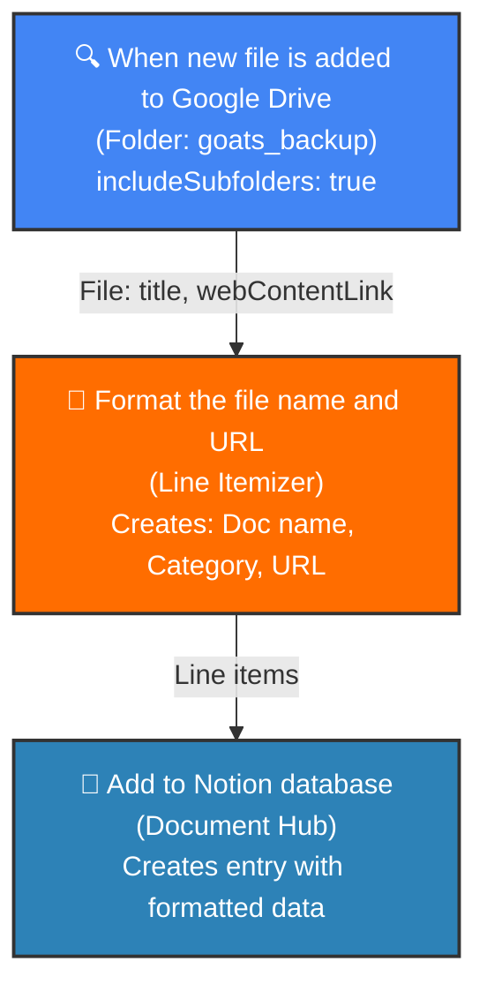

---
title: Zapier - Add new Google Drive files to Notion database
deprecated: false
hidden: false
metadata:
  robots: index
---

| Attribute | Value |
| ----------|-------|
| ID | 360080054 |
| Title | Add new Google Drive files to Notion database |
| Status| on |

